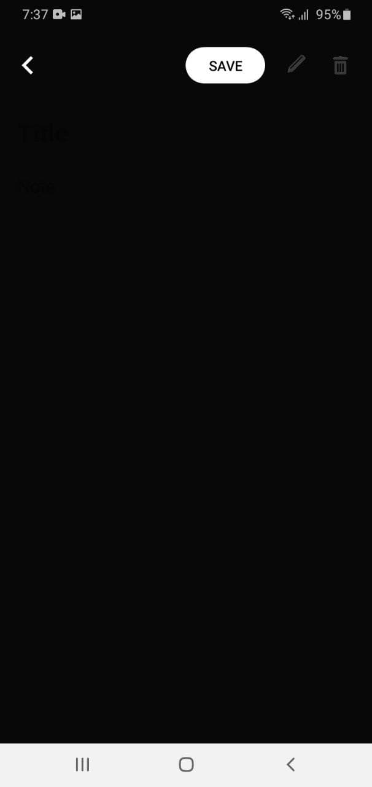

# Notee - Your Idea Saver!
 

 
 

Notee is your android notes app that you will save your notes, ideas and todo's. It saves your time and make your work efficient by saving your project ideas here. You don't have to worry about your notes! They will be saved on your phone database.

 
 

# Appearance
<b>

 
    
    
    

    
    
    

 

# Features
1. You can add notes without clicking save buttton.
2. You can sort your notes based on alphabet or date created.
3. It can habitat with your theme mode.
4. You can easily delete and edit your notes.

# Release

To download the app checkout the  playstore link that is https://play.google.com/store/apps/details?id=com.abdesol.notee

# Contribution

I am welcome to anyone who wants to add some features or make a different version of this app :)
